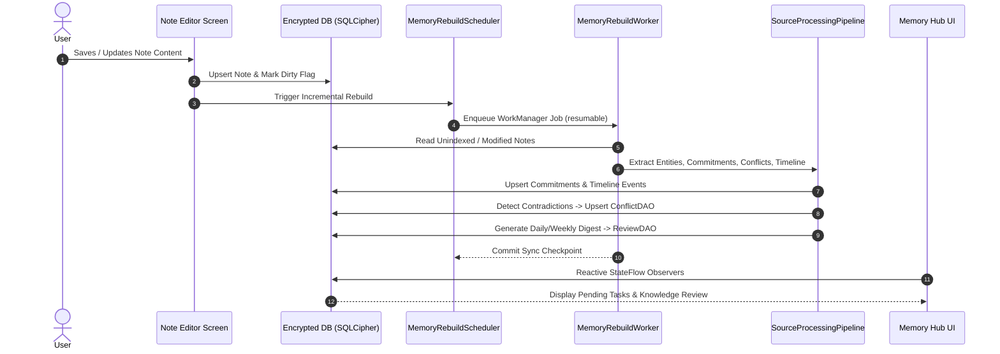
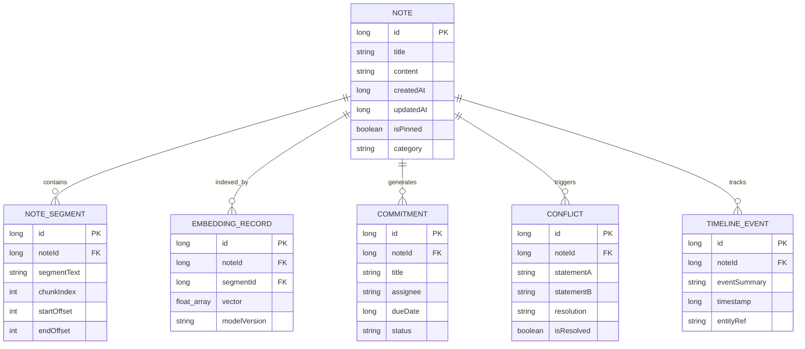

# NoteFlow AI — Project Handoff & Technical Architecture Guide

Welcome to **NoteFlow AI** — a 100% private, on-device note-taking system equipped with a 2-stage Hybrid Retrieval-Augmented Generation (RAG) engine, an Autonomous Memory Layer & Knowledge Graph, and sub-second native AI inference.

---

## 📋 Table of Contents
1. [Executive Overview](#-executive-overview)
2. [Visual Architecture & Subsystem Diagrams](#-visual-architecture--subsystem-diagrams)
3. [Architecture Decision Highlights (ADRs)](#-architecture-decision-highlights-adrs)
4. [Key Architecture & Core Subsystems](#-key-architecture--core-subsystems)
5. [Known Limitations & Debugging Guide](#-known-limitations--debugging-guide)
6. [Performance Baselines](#-performance-baselines)
7. [Dependency Snapshot](#-dependency-snapshot)
8. [On-Device & Cloud AI Models Catalog](#-on-device--cloud-ai-models-catalog)
9. [Developer Setup & Quick Verification](#-developer-setup--quick-verification)
10. [Contributing & Security Policy](#-contributing--security-policy)
11. [Roadmap & Next Steps](#-roadmap--next-steps)

---

## 🚀 Executive Overview

NoteFlow AI is built to give users an **autonomous, private second brain** operating completely offline on Android hardware. Unlike cloud-dependent note applications, NoteFlow AI processes raw text, voice recordings, documents, and knowledge queries locally without telemetry or subscription paywalls.

### Key Capabilities:
- **Omni-Capture Speed Dial**: Record voice notes processed locally via `whisper.cpp`, capture documents via camera OCR, or import PDF and YouTube transcripts.
- **Autonomous Knowledge Graph & Personal Memory**: Automatically extracts entities, commitments, temporal events, and decision conflicts from user notes.
- **2-Stage Hybrid RAG**: Merges FTS5 full-text keyword retrieval with ONNX semantic vector embeddings, refined by an Alibaba GTE neural cross-encoder for zero-hallucination note grounded chat with exact citations (`[1]`, `[2]`).
- **Google LiteRT-LM Inference**: Direct execution of `Gemma 4 E2B/E4B` models on OpenCL GPU / XNNPACK CPU with zero cloud latency.

---

## 📊 Visual Architecture & Subsystem Diagrams

### 1. Data Flow: 2-Stage Hybrid RAG Query Flow
```mermaid
flowchart TD
    UserQuery([User Question / Prompt]) --> QueryParser[QueryParser & Stopwords Extractor]
    
    subgraph Stage1 [Stage 1: Multi-Modal Candidate Retrieval]
        QueryParser -->|FTS Match Query| FTS5[(SQLite FTS5 Full-Text Index)]
        QueryParser -->|Tokenized Text| EmbedModel[IBM Granite 311M Multilingual ONNX]
        EmbedModel --> VectorSearch[Cosine Vector Similarity Search]
        FTS5 --> RRF[Reciprocal Rank Fusion - RRF]
        VectorSearch --> RRF
    end

    subgraph Stage2 [Stage 2: Cross-Attention Neural Reranking]
        RRF -->|Top-N Raw Candidates| GteTok[GteTokenizer - Unigram Viterbi]
        GteTok --> GteModel[Alibaba GTE INT8 Cross-Encoder ONNX]
        GteModel --> RerankerScores[Deep Relevance Scoring & Gating]
    end

    subgraph Generation [Stage 3: Grounded Context Assembly & Inference]
        RerankerScores --> Budgeter[PromptAssembler - Dynamic Per-Excerpt Budget]
        Budgeter --> PromptBuilder[OfflineRagPromptBuilder - Strict Citation Isolation]
        PromptBuilder --> LiteRT[Google LiteRT-LM Engine - Gemma 4 E2B/E4B]
        LiteRT -->|OpenCL GPU / XNNPACK CPU| StreamCallback[MessageCallback Streaming Bridge]
    end

    StreamCallback --> FinalUI([Grounded Answer with [1], [2] Citation Badges])
```

### 2. Autonomous Memory Layer Lifecycle


### 3. Database Entity Relationship Diagram


---

## 🏛️ Architecture Decision Highlights (ADRs)

### 1. Why Google LiteRT-LM over legacy llama.cpp and TFLite?
- **Hardware Acceleration**: LiteRT (Google AI Edge's next-generation runtime) provides first-class OpenCL GPU execution and Qualcomm Adreno/ARM Mali tuning, dropping time-to-first-token (TTFT) significantly.
- **Memory & JNI Stability**: Replaced custom C++ JNI bridge code with the official `com.google.ai.edge.litertlm:litertlm-android` SDK, eliminating JNI memory leaks and ABI crashes.
- **Trade-off**: LiteRT models use the `.litertlm` format rather than standard `.gguf`. We mitigated this by offering automated in-app model downloads for Gemma 4 E2B and E4B.

### 2. Why 2-Stage Hybrid RAG (FTS5 + ONNX Vectors + GTE Cross-Encoder)?
- **FTS5 (Keyword)** excels at exact technical terminology, IDs, names, and recent note dates.
- **Dense Vectors (Granite ONNX)** capture semantic meaning and natural phrasing.
- **Cross-Encoder Reranker (Alibaba GTE)** performs cross-attention between question and candidate excerpts, eliminating false-positive matches that naive cosine similarity often includes.
- **Trade-off**: Requires maintaining both SQLite FTS5 indices and vector store files, and running a secondary neural inference pass (~30ms overhead). The return is pinpoint citation accuracy (`[1]`, `[2]`) with near-zero hallucinations.

### 3. Why Streaming Atomic JSON I/O (`AtomicJsonFile`) over SQLite BLOBs for Vector Storage?
- **OOM Prevention**: Writing hundreds of 384-dimensional floating-point vectors into SQLite BLOB columns within Room transactions caused severe memory spikes and SQLite cursor window limits (2 MB cursor limit).
- **Crash Durability**: Vector indices are streamed sequentially via `AtomicJsonFile`, utilizing a write-to-temp-then-rename filesystem operation that ensures atomic consistency without SQLite transaction lock contention.
- **Trade-off**: Reads require deserialization into memory buffers during search, but index persistence remains completely crash-safe and OOM-proof.

### 4. Why SQLCipher Encryption over Standard SQLite?
- **Zero-Trust Local Privacy**: Note contents, user commitments, transcripts, and personal reflections are protected at rest. If a device is extracted or inspected, user data remains securely encrypted with AES-256.

---

## 🏗️ Key Architecture & Core Subsystems

### 1. On-Device LLM & RAG Engine
- **LiteRtInferenceManager** (`data/LiteRtInferenceManager.kt`): Coordinates model loading, context caching, OpenCL GPU acceleration, and CPU fallback. Bridges streaming tokens to Kotlin coroutines via `MessageCallback`.
- **HybridRetriever** (`data/search/HybridRetriever.kt`): Implements Reciprocal Rank Fusion (RRF) between FTS5 search results and vector nearest-neighbors.
- **GteRerankerManager** (`data/search/reranker/GteRerankerManager.kt`): Executes quantized INT8 ONNX cross-encoder inference using Unigram Viterbi token pairs (`GteTokenizer.kt`).
- **OfflineRagPromptBuilder** (`util/OfflineRagPromptBuilder.kt`): Assembles grounded prompt templates, enforcing citation isolation so that notes are only retrieved and referenced when in note-grounded chat mode.

### 2. Autonomous Memory Layer & Knowledge Graph
- **MemoryRebuildWorker** (`service/MemoryRebuildWorker.kt`): Asynchronous background worker executed via WorkManager. Features session resumption checkpoints so incremental indexing survives app termination.
- **Memory Hub** (`ui/screens/MemoryHubScreen.kt`): Displays extracted commitments, conflicting facts requiring resolution, and review digests via reactive Room DAOs (`CommitmentDao`, `ConflictDao`, `ReviewDao`).

### 3. Speech-to-Text & Omni-Capture
- **Native whisper.cpp JNI Bridge** (`cpp/whisper.cpp`): Custom JNI integration compiled through Android NDK and CMake, transcribing 16 kHz WAV audio offline without sending audio bytes over the network.
- **Multi-Source Importers**: Document camera OCR (ML Kit Text Recognition v2), PDF (PdfBox-Android), DOCX (Apache POI), and YouTube transcript importer.

---

## ⚠️ Known Limitations & Debugging Guide

### Device & OS Compatibility
- **Primary Tested Devices**: Pixel 6a, Pixel 7/8 (Android 13–15, API 33–35), Samsung Galaxy S21/S23 (Android 12–14, API 31–34).
- **Minimum Supported OS**: Android 8.0 (API 26); Recommended: Android 11+ (API 30+).
- **Low-Memory Devices (< 6 GB RAM)**:
  - The Gemma 4 E4B (~2.4 GB) model may cause Android low-memory killer (LMK) aborts on devices with 4–6 GB RAM.
  - **Resolution**: Use the default **Gemma 4 E2B (~1.2 GB)** model. `android:largeHeap="true"` is declared in `AndroidManifest.xml` to grant maximum heap allocation.
- **Android Emulators**:
  - Emulators lacking GPU passthrough will fail to initialize OpenCL compute. The app automatically catches this and falls back to CPU XNNPACK. If debugging emulator graphics, choose "Software GLES 2.0" or test on physical hardware.

### Common Build Failures & Resolutions

| Error Message / Symptom | Root Cause | Verified Solution |
| :--- | :--- | :--- |
| `CMake '3.22.1' was not found` | CMake missing from SDK tools | Android Studio > SDK Manager > SDK Tools > CMake > Check `3.22.1` > Apply |
| `ninja: command not found` or NDK build error | NDK version mismatch | Ensure NDK `27.0.12077973` is installed and specified in `app/build.gradle.kts` |
| `UnsatisfiedLinkError: dlopen failed: library "libOpenCL.so" not found` | Device/emulator lacks OpenCL driver | Ensure `AndroidManifest.xml` includes `<uses-native-library android:name="libOpenCL.so" android:required="false" />` (already configured) |
| `OutOfMemoryError: Java heap space` during `./gradlew assembleDebug` | Gradle daemon memory cap | Verify `gradle.properties` contains `org.gradle.jvmargs=-Xmx6144m` |

### Runtime Debugging Tips
- **Filter Logcat**:
  ```bash
  adb logcat -v time | grep -E "NoteFlow|LiteRt|HybridRetriever|MemoryRebuild"
  ```
- **Inspect Cached Models**:
  ```bash
  adb shell ls -lh /sdcard/Android/data/com.noteflowai.app/files/models/
  ```
- **Monitor Memory Heap During Inference**:
  Open **Android Studio > Profiler > Memory**, trigger a RAG conversation, and verify that native and Java heaps stabilize without unbounded spikes.

---

## ⚡ Performance Baselines

*Tested on Google Pixel 6a (Tensor G1, 6GB RAM, Android 14):*

| Operation | Typical Latency | Notes |
| :--- | :--- | :--- |
| **First-Launch Model Download (E2B)** | ~6–8 min | 1.2 GB download over 100 Mbps Wi-Fi |
| **Note Indexing (1,000 words)** | ~45–60 ms | Segmenting, FTS5 insert & Granite vector encoding |
| **Hybrid RAG Query (FTS5 + Vector + RRF)** | ~110–140 ms | Stage 1 candidate retrieval across 500+ notes |
| **Neural Cross-Encoder Reranking** | ~25–35 ms | Stage 2 GTE INT8 ONNX scoring for top 10 candidates |
| **Time-to-First-Token (TTFT) Gemma 4 E2B** | ~750–900 ms | OpenCL GPU accelerated |
| **Generation Speed (Gemma 4 E2B)** | ~18–22 tokens/sec | OpenCL GPU streaming |
| **Memory Rebuild Pipeline (100 notes)** | ~85–110 ms | Background asynchronous WorkManager job |

*Performance Regression Gate: If any future change degrades these latencies by >20%, review memory allocations and model threading.*

---

## 📦 Dependency Snapshot

### Critical Pinned Dependencies
| Component / Library | Tested Version | Purpose |
| :--- | :--- | :--- |
| **JDK** | `17` (Temurin / OpenJDK) | Compiler runtime |
| **Kotlin** | `2.0.0` | Primary language |
| **Android Gradle Plugin (AGP)** | `9.2.1` | Build system |
| **Android NDK** | `27.0.12077973` | C++ compilation for whisper.cpp |
| **CMake** | `3.22.1` | Native build orchestration |
| **Jetpack Compose BOM** | `2026.06.01` | Declarative UI framework |
| **Google LiteRT-LM** | `0.17.1` (`litertlm-android`) | Gemma 4 on-device local inference |
| **ONNX Runtime Android** | `1.23.2` | Granite embeddings & GTE reranker |
| **AndroidX Room** | `2.7.1` | Local SQLite database |
| **SQLCipher Android** | `4.17.0` | Database encryption at rest |
| **AndroidX WorkManager** | `2.9.1` | Background memory rebuild jobs |
| **Retrofit / OkHttp** | `2.9.0` / `4.12.0` | Optional remote API calls |

---

## 🤖 On-Device & Cloud AI Models Catalog

| Model Type | Default / Recommended Model | Storage Size | Runtime Engine | Location / Config |
| :--- | :--- | :--- | :--- | :--- |
| **Local LLM** | Gemma 4 E2B (`.litertlm`) | ~1.2 GB | Google LiteRT-LM | Settings > AI Engine |
| **Local LLM (Large)** | Gemma 4 E4B (`.litertlm`) | ~2.4 GB | Google LiteRT-LM | Settings > AI Engine |
| **Cross-Encoder Reranker** | Alibaba GTE ONNX INT8 | ~340 MB | ONNX Runtime | Settings > AI Intelligence |
| **Vector Embeddings** | IBM Granite 311M Multilingual | ~120 MB | ONNX Runtime | Settings > AI Intelligence |
| **Voice Speech-to-Text** | Whisper Base / Tiny | ~75 - 140 MB | whisper.cpp JNI | Settings > Voice & Speech |
| **Cloud LLM (Optional)** | OpenAI / Gemini / Claude / Ollama | N/A | Retrofit HTTP | Settings > Remote Providers |

---

## 🛠️ Developer Setup & Quick Verification

For complete setup instructions and release signing steps, consult [SETUP.md](file:///h:/Work/NoteFlowAI/SETUP.md).

### Quick Verification Commands:
```bash
# 1. Clean and build APK
./gradlew assembleDebug

# 2. Run the complete unit test suite
./gradlew testDebugUnitTest

# 3. Install to connected device
./gradlew installDebug
```

---

## 🛡️ Contributing & Security Policy

All code contributions must follow the strict privacy and zero-telemetry guidelines outlined in [CONTRIBUTING.md](file:///h:/Work/NoteFlowAI/CONTRIBUTING.md).
- **Private by Design**: No telemetry, analytics, or crash reporters.
- **Never Commit Secrets**: No API keys, credentials, or keystores in git.
- **Never Commit Model Binaries**: Weights are downloaded on-demand into app storage.

---

## 🗺️ Roadmap & Next Steps

1. **LiteRT 4-bit AWQ Quantization**: Further compress Gemma 4 models to reduce memory footprint on entry-level devices (< 4GB RAM).
2. **Multi-Modal Visual RAG**: Embed captured document photographs and diagrams directly into the vector space.
3. **Encrypted P2P Sync**: Implement local Wi-Fi direct device-to-device synchronization with zero cloud dependence.
4. **Interactive Home Screen Widgets**: Add push-to-talk instant capture and pending commitment widgets to the Android home screen.

---

*Handed off by NoteFlow AI Engineering Team — Built for privacy, speed, and autonomous intelligence.*
