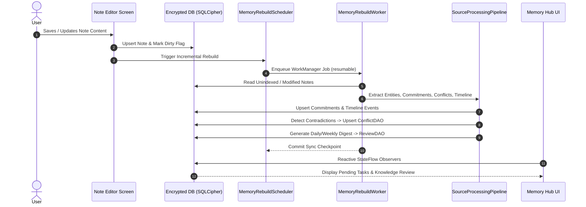
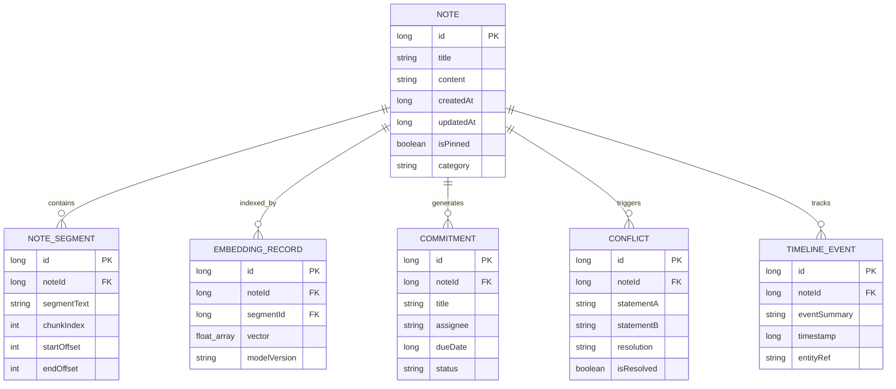

# NoteFlow AI — Project Handoff & Technical Architecture Guide

Welcome to **NoteFlow AI** — a 100% private, on-device note-taking system equipped with a 2-stage Hybrid Retrieval-Augmented Generation (RAG) engine, an Autonomous Memory Layer & Knowledge Graph, and sub-second native AI inference.

---

## 📋 Table of Contents
1. [Executive Overview](#-executive-overview)
2. [Contributor Entry Points & Workflow Map](#-contributor-entry-points--workflow-map)
3. [What a First-Time Developer Should Expect](#-what-a-first-time-developer-should-expect)
4. [Visual Architecture & Subsystem Diagrams](#-visual-architecture--subsystem-diagrams)
5. [Architecture Decision Highlights (ADRs)](#-architecture-decision-highlights-adrs)
6. [Key Architecture & Core Subsystems](#-key-architecture--core-subsystems)
7. [Hardware & Device Tier Support Matrix](#-hardware--device-tier-support-matrix)
8. [Known Bad States & Incident Recovery Playbook](#-known-bad-states--incident-recovery-playbook)
9. [Operational Ownership & Support Model](#-operational-ownership--support-model)
10. [Release Checklist & QA Gate](#-release-checklist--qa-gate)
11. [Performance Baselines](#-performance-baselines)
12. [Dependency & Toolchain Snapshot](#-dependency--toolchain-snapshot)
13. [On-Device & Cloud AI Models Catalog](#-on-device--cloud-ai-models-catalog)
14. [Developer Setup & Quick Verification](#-developer-setup--quick-verification)
15. [Contributing & Security Policy](#-contributing--security-policy)
16. [Roadmap & Next Steps](#-roadmap--next-steps)

---

## 🚀 Executive Overview

NoteFlow AI is built to give users an **autonomous, private second brain** operating completely offline on Android hardware. Unlike cloud-dependent note applications, NoteFlow AI processes raw text, voice recordings, documents, and knowledge queries locally without telemetry or subscription paywalls.

### Key Superpowers:
- **Omni-Capture Speed Dial**: Record voice notes processed locally via `whisper.cpp`, capture documents via camera OCR, or import PDF and YouTube transcripts.
- **Autonomous Knowledge Graph & Personal Memory**: Automatically extracts entities, commitments, temporal events, and decision conflicts from user notes.
- **2-Stage Hybrid RAG**: Merges FTS5 full-text keyword retrieval with ONNX semantic vector embeddings, refined by an Alibaba GTE neural cross-encoder for zero-hallucination note grounded chat with exact citations (`[1]`, `[2]`).
- **Google LiteRT-LM Inference**: Direct execution of `Gemma 4 E2B/E4B` models on OpenCL GPU / XNNPACK CPU with zero cloud latency.

---

## 🧭 Contributor Entry Points & Workflow Map

| If you want to... | Start Here | What you will find |
| :--- | :--- | :--- |
| **Compile & install the app locally** | 🚀 **[SETUP.md](SETUP.md)** | 5-minute setup, NDK/CMake sync, run commands & build troubleshooting |
| **Understand system design & ADRs** | 📖 **[HANDOFF.md](HANDOFF.md)** | Architecture diagrams, trade-off decisions, incident runbook & ownership |
| **Contribute code or submit a PR** | 🛡️ **[CONTRIBUTING.md](CONTRIBUTING.md)** | PR requirements, code conventions, zero-telemetry rules & secret policies |
| **Validate release candidate readiness** | ✅ **[RELEASE_CHECKLIST.md](docs/RELEASE_CHECKLIST.md)** | Automated gates, manual smoke tests & signing procedures |
| **Debug or recover from bad states** | 🚨 **[Incident Runbook](#-known-bad-states--incident-recovery-playbook)** | Model corruption recovery, vector index reset, and OOM failover |
| **Report a security vulnerability** | 🔒 **[Security Advisory](https://github.com/Archeon84/noteflowai/security/advisories/new)** | Private vulnerability disclosure portal |

---

## ⏱️ What a First-Time Developer Should Expect

When checking out and building NoteFlow AI for the first time, here are the exact timings, behaviors, and expected milestones:

### 1. Build Timings
- **First Clean Build (`./gradlew assembleDebug`)**: ~2.5 to 4.5 minutes. Gradle downloads dependencies and CMake compiles native C++ code (`whisper.cpp`).
- **Incremental Builds**: ~15 to 30 seconds.
- **Unit Test Execution (`./gradlew testDebugUnitTest`)**: ~1.5 to 2.5 minutes across all Robolectric and Room migration test suites.

### 2. First Run & Onboarding Flow
- On initial launch, the app displays the **NoteFlow AI Intro / Onboarding Screen** highlighting privacy features, offline capabilities, and permission requests.
- No AI model is bundled in the base APK (keeping the initial download size around ~45 MB).
- **First Model Setup**: Navigating to **Settings > AI Engine** allows downloading the recommended **Gemma 4 E2B (~1.2 GB)** model. On a 100 Mbps Wi-Fi connection, download takes ~5–8 minutes with a progress bar and background resumption support.

### 3. Normal Logcat Output vs. Errors
When monitoring `adb logcat | grep NoteFlow`:
- **Expected Informational Logs**:
  ```text
  I/NoteFlow: Initializing LiteRtInferenceManager (OpenCL GPU accelerated)
  I/NoteFlow: SQLCipher database opened successfully
  I/NoteFlow: HybridRetriever: Stage 1 returned 8 candidates in 32ms
  I/NoteFlow: GteReranker: Stage 2 scored 8 items in 28ms
  ```
- **Benign Fallbacks (Not Bugs)**:
  - `W/NoteFlow: OpenCL device not found, falling back to CPU XNNPACK backend`: Happens on Android Emulators or devices without OpenCL compute drivers. The app seamlessly continues execution on CPU.
  - `D/NoteFlow: Suppressing note retrieval for Assistant mode`: Occurs when user switches to general knowledge chat without note grounding.

---

## 📊 Visual Architecture & Subsystem Diagrams

### 1. Data Flow: 2-Stage Hybrid RAG Query Flow
```mermaid
flowchart TD
    UserQuery([User Question / Prompt]) --> QueryParser[QueryParser & Stopwords Extractor]
    
    subgraph Stage1 [Stage 1: Multi-Modal Candidate Retrieval]
        QueryParser -->|FTS Match Query| FTS5[(SQLite FTS5 Full-Text Index)]
        QueryParser -->|Tokenized Text| EmbedModel[IBM Granite 311M Multilingual ONNX]
        EmbedModel --> VectorSearch[Cosine Vector Similarity Search]
        FTS5 --> RRF[Reciprocal Rank Fusion - RRF]
        VectorSearch --> RRF
    end

    subgraph Stage2 [Stage 2: Cross-Attention Neural Reranking]
        RRF -->|Top-N Raw Candidates| GteTok[GteTokenizer - Unigram Viterbi]
        GteTok --> GteModel[Alibaba GTE INT8 Cross-Encoder ONNX]
        GteModel --> RerankerScores[Deep Relevance Scoring & Gating]
    end

    subgraph Generation [Stage 3: Grounded Context Assembly & Inference]
        RerankerScores --> Budgeter[PromptAssembler - Dynamic Per-Excerpt Budget]
        Budgeter --> PromptBuilder[OfflineRagPromptBuilder - Strict Citation Isolation]
        PromptBuilder --> LiteRT[Google LiteRT-LM Engine - Gemma 4 E2B/E4B]
        LiteRT -->|OpenCL GPU / XNNPACK CPU| StreamCallback[MessageCallback Streaming Bridge]
    end

    StreamCallback --> FinalUI([Grounded Answer with [1], [2] Citation Badges])
```

### 2. Autonomous Memory Layer Lifecycle


### 3. Database Entity Relationship Diagram


---

## 🏛️ Architecture Decision Highlights (ADRs)

### 1. Why Google LiteRT-LM over legacy llama.cpp and TFLite?
- **Hardware Acceleration**: LiteRT (Google AI Edge's next-generation runtime) provides first-class OpenCL GPU execution and Qualcomm Adreno/ARM Mali tuning, dropping time-to-first-token (TTFT) significantly.
- **Memory & JNI Stability**: Replaced custom C++ JNI bridge code with the official `com.google.ai.edge.litertlm:litertlm-android` SDK, eliminating JNI memory leaks and ABI crashes.
- **Trade-off**: LiteRT models use the `.litertlm` format rather than standard `.gguf`. We mitigated this by offering automated in-app model downloads for Gemma 4 E2B and E4B.

### 2. Why 2-Stage Hybrid RAG (FTS5 + ONNX Vectors + GTE Cross-Encoder)?
- **FTS5 (Keyword)** excels at exact technical terminology, IDs, names, and recent note dates.
- **Dense Vectors (Granite ONNX)** capture semantic meaning and natural phrasing.
- **Cross-Encoder Reranker (Alibaba GTE)** performs cross-attention between question and candidate excerpts, eliminating false-positive matches that naive cosine similarity often includes.
- **Trade-off**: Requires maintaining both SQLite FTS5 indices and vector store files, and running a secondary neural inference pass (~30ms overhead). The return is pinpoint citation accuracy (`[1]`, `[2]`) with near-zero hallucinations.

### 3. Why Streaming Atomic JSON I/O (`AtomicJsonFile`) over SQLite BLOBs for Vector Storage?
- **OOM Prevention**: Writing hundreds of 384-dimensional floating-point vectors into SQLite BLOB columns within Room transactions caused severe memory spikes and SQLite cursor window limits (2 MB cursor limit).
- **Crash Durability**: Vector indices are streamed sequentially via `AtomicJsonFile`, utilizing a write-to-temp-then-rename filesystem operation that ensures atomic consistency without SQLite transaction lock contention.
- **Trade-off**: Reads require deserialization into memory buffers during search, but index persistence remains completely crash-safe and OOM-proof.

### 4. Why SQLCipher Encryption over Standard SQLite?
- **Zero-Trust Local Privacy**: Note contents, user commitments, transcripts, and personal reflections are protected at rest. If a device is extracted or inspected, user data remains securely encrypted with AES-256.

---

## 🏗️ Key Architecture & Core Subsystems

### 1. On-Device LLM & RAG Engine
- **LiteRtInferenceManager** (`app/src/main/java/com/noteflowai/app/data/LiteRtInferenceManager.kt`): Coordinates model loading, context caching, OpenCL GPU acceleration, and CPU fallback. Bridges streaming tokens to Kotlin coroutines via `MessageCallback`.
- **HybridRetriever** (`app/src/main/java/com/noteflowai/app/data/search/HybridRetriever.kt`): Implements Reciprocal Rank Fusion (RRF) between FTS5 search results and vector nearest-neighbors.
- **GteRerankerManager** (`app/src/main/java/com/noteflowai/app/data/search/reranker/GteRerankerManager.kt`): Executes quantized INT8 ONNX cross-encoder inference using Unigram Viterbi token pairs (`GteTokenizer.kt`).
- **OfflineRagPromptBuilder** (`app/src/main/java/com/noteflowai/app/util/OfflineRagPromptBuilder.kt`): Assembles grounded prompt templates, enforcing citation isolation so that notes are only retrieved and referenced when in note-grounded chat mode.

### 2. Autonomous Memory Layer & Knowledge Graph
- **MemoryRebuildWorker** (`app/src/main/java/com/noteflowai/app/service/MemoryRebuildWorker.kt`): Asynchronous background worker executed via WorkManager. Features session resumption checkpoints so incremental indexing survives app termination.
- **Memory Hub** (`app/src/main/java/com/noteflowai/app/ui/screens/MemoryHubScreen.kt`): Displays extracted commitments, conflicting facts requiring resolution, and review digests via reactive Room DAOs (`CommitmentDao`, `ConflictDao`, `ReviewDao`).

### 3. Speech-to-Text & Omni-Capture
- **Native whisper.cpp JNI Bridge** (`app/src/main/cpp/whisper.cpp`): Custom JNI integration compiled through Android NDK and CMake, transcribing 16 kHz WAV audio offline without sending audio bytes over the network.
- **Multi-Source Importers**: Document camera OCR (ML Kit Text Recognition v2), PDF (PdfBox-Android), DOCX (Apache POI), and YouTube transcript importer.

---

## 🚨 Known Bad States & Incident Recovery Playbook

When maintaining or debugging NoteFlow AI in development or production, use this playbook for common failure modes:

### Playbook 1: Partial or Corrupted Model Downloads
- **Symptom**: Model download hangs at 99%, or LiteRT throws `Model initialization failed: invalid header / truncated file`.
- **Root Cause**: Network dropped midway or user backgrounded the app during non-atomic download finalization.
- **Recovery Procedure**:
  1. Open device terminal or adb:
     ```bash
     adb shell rm -rf /sdcard/Android/data/com.noteflowai.app/cache/models/temp_*
     adb shell rm -f /sdcard/Android/data/com.noteflowai.app/files/models/*.litertlm
     ```
  2. In the app: Go to **Settings > AI Engine**, tap **Delete Model**, then re-tap **Download**.

### Playbook 2: Vector or Segment Index Desynchronization
- **Symptom**: RAG search yields 0 results even when relevant notes exist, or vector index throws `JsonSyntaxException`.
- **Root Cause**: Force-close during an older uncommitted index write.
- **Recovery Procedure**:
  1. Trigger automated rebuild: In **Settings > Developer / Diagnostics**, tap **Rebuild Knowledge Graph & Vector Index**.
  2. Or programmatically clear the index file:
     ```bash
     adb shell rm -f /data/data/com.noteflowai.app/files/embeddings/vector_index.json
     ```
  3. The `MemoryRebuildWorker` automatically detects missing indices and re-indexes all active notes from the encrypted database.

### Playbook 3: Low-Memory Killer (LMK) Aborts on Devices with < 6GB RAM
- **Symptom**: App suddenly vanishes during inference without an unhandled Java stacktrace; logcat shows `lmkd: kill com.noteflowai.app`.
- **Root Cause**: Attempting to load the 2.4 GB Gemma 4 E4B model on a device with limited physical RAM.
- **Recovery Procedure**:
  1. Open app **Settings > AI Engine**.
  2. Select **Gemma 4 E2B (~1.2 GB)** as the default model.
  3. Ensure `android:largeHeap="true"` remains active in `AndroidManifest.xml`.

### Playbook 4: Native JNI Audio / Whisper Crash
- **Symptom**: Tapping the voice recording stop button triggers `SIGSEGV` or `whisper_full failed`.
- **Root Cause**: Audio buffer captured at non-16kHz sample rate or zero-byte WAV header.
- **Recovery Procedure**:
  - Verify audio recorder configuration in `AudioRecordController.kt`: Audio format must be 16-bit PCM, 16,000 Hz, single channel (mono).

---

## 👥 Operational Ownership & Support Model

To ensure accountability and structured collaboration, operational responsibilities are organized as follows:

| Functional Area | Primary Owner | Secondary / Backup | Responsibilities |
| :--- | :--- | :--- | :--- |
| **Lead Architecture & Core Engine** | NoteFlow AI Core Team | Tech Lead | Core architecture decisions, ADR reviews, Room schema migrations |
| **On-Device AI & Models Pipeline** | AI / Edge ML Engineer | Core Maintainer | LiteRT-LM updates, ONNX model quantizations, GTE tokenizer & reranker |
| **Audio & Native C++ (whisper.cpp)** | Native / Systems Engineer | Android Engineer | NDK toolchain, CMake scripts, audio sampling, JNI stability |
| **UI / UX & Accessibility** | Android Frontend Lead | UI Designer | Jetpack Compose screens, Material 3 theming, TalkBack compliance |
| **Build & Release Engineering** | Release Engineer | DevOps | Gradle build optimization, release signing, ProGuard mappings, CI/CD |
| **Security & Privacy Compliance** | Security Officer | Core Architect | Zero-telemetry validation, SQLCipher encryption, secret sanitization |

### Communication Channels:
- **Bug Reports & Feature Requests**: [GitHub Issues](https://github.com/Archeon84/noteflowai/issues)
- **Security Vulnerabilities**: File a private advisory directly via [GitHub Security Advisories](https://github.com/Archeon84/noteflowai/security/advisories/new) (please do not disclose security issues in public tickets).

### Branching, Merge & Release Approval Policy:
- **Protected Trunk (`main`)**: Direct pushes to `main` are restricted. All contributions must arrive via Pull Requests.
- **CI Enforcement**: Every PR must pass the automated GitHub Actions Android CI pipeline (`testDebugUnitTest` and `assembleDebug`) before merging.
- **Release Sign-Off**: Production releases are tagged with semantic versioning (`vMAJOR.MINOR.PATCH`) from `main` and require explicit sign-off from both the **Lead Architect** and the **Release Engineer**.

---

## 📱 Hardware & Device Tier Support Matrix

| Tier | Target Devices / SoCs | Recommended Model | Expected Performance | Fallback / Behavior |
| :--- | :--- | :--- | :--- | :--- |
| **Tier 1 (Flagship)** | 8 GB+ RAM, Snapdragon 8 Gen 1+, Tensor G2/G3/G4, Dimensity 9000+ | Gemma 4 E4B (~2.4 GB) or E2B (~1.2 GB) | ~20–25 tokens/sec, TTFT < 700 ms | Full OpenCL GPU acceleration |
| **Tier 2 (Mid-Range)** | 6 GB RAM, Snapdragon 778G+, Tensor G1, Exynos 2100+ | Gemma 4 E2B (~1.2 GB) | ~15–20 tokens/sec, TTFT < 900 ms | OpenCL GPU acceleration, `largeHeap` enabled |
| **Tier 3 (Budget / Low-RAM)**| 4 GB RAM, Helio G99, Snapdragon 680 | Gemma 4 E2B or Cloud Fallback | ~6–10 tokens/sec (CPU XNNPACK) | CPU fallback; user prompted to use Cloud APIs if device encounters memory pressure |
| **Emulator** | Android Studio Emulator (x86_64, API 30+) | Gemma 4 E2B (Testing only) | ~5–8 tokens/sec | OpenCL unavailable; automatically switches to CPU XNNPACK |

---

## 🚦 Release Checklist & QA Gate

Before any release build is approved for distribution, all gates below must be verified. A detailed pre-flight form is located in **[RELEASE_CHECKLIST.md](docs/RELEASE_CHECKLIST.md)**.

### Gate 1: Automated Verification
- [ ] `./gradlew :app:assembleDebug` compiles cleanly.
- [ ] `./gradlew :app:testDebugUnitTest` passes 100% of tests.
- [ ] `./gradlew :app:lintDebug` passes with no new non-baseline high-severity findings.

### Gate 2: Device Smoke Test Matrix
- [ ] **Physical Hardware Smoke (API 33+)**: Verified on Pixel 6a/7/8 or Galaxy S21/S23.
- [ ] **Fresh Install Test**: App starts cleanly, completes onboarding, and creates first note.
- [ ] **Offline Voice Test**: Airplane Mode enabled; 30-second voice note recorded and transcribed via `whisper.cpp`.
- [ ] **Local RAG Grounding Test**: Ask question grounded in notes; verify footnote citation `[1]` opens correct source note.
- [ ] **Insufficient Evidence Refusal**: Ask question outside notes; verify app refuses hallucinated claims.

### Gate 3: Memory & Performance Validation
- [ ] Run Android Studio Memory Profiler: Peak memory during Gemma 4 E2B generation does not exceed 1.8 GB.
- [ ] Verify that exiting the chat screen properly releases inference context buffers.

### Gate 4: Release Signing & ProGuard
- [ ] `./gradlew assembleRelease` signed with production release keystore.
- [ ] ProGuard mapping file (`app/build/outputs/mapping/release/mapping.txt`) archived for symbolication.

---

## ⚡ Performance Baselines

> **Empirical Context**: Metrics below represent empirical baseline measurements performed on a physical **Google Pixel 6a** (Google Tensor G1 SoC, 6 GB RAM, Android 14) under ambient room temperatures. Latencies and tokens/sec are representative reference figures and will naturally vary based on device SoC tier, background system load, thermal throttling, and available memory.

| Operation | Typical Latency (Pixel 6a) | Notes |
| :--- | :--- | :--- |
| **First-Launch Model Download (E2B)** | ~6–8 min | 1.2 GB download over 100 Mbps Wi-Fi |
| **Note Indexing (1,000 words)** | ~45–60 ms | Segmenting, FTS5 insert & Granite vector encoding |
| **Hybrid RAG Query (FTS5 + Vector + RRF)** | ~110–140 ms | Stage 1 candidate retrieval across 500+ notes |
| **Neural Cross-Encoder Reranking** | ~25–35 ms | Stage 2 GTE INT8 ONNX scoring for top 10 candidates |
| **Time-to-First-Token (TTFT) Gemma 4 E2B** | ~750–900 ms | OpenCL GPU accelerated |
| **Generation Speed (Gemma 4 E2B)** | ~18–22 tokens/sec | OpenCL GPU streaming |
| **Memory Rebuild Pipeline (100 notes)** | ~85–110 ms | Background asynchronous WorkManager job |

*Performance Regression Gate: If any future change degrades these latencies by >20%, review memory allocations and model threading.*

---

## 📦 Dependency & Toolchain Snapshot

### Exact Repo Versions (Verified Against Build Scripts)
| Component / Tool | Verified Version | Configuration Location | Purpose |
| :--- | :--- | :--- | :--- |
| **JDK** | `17` | `app/build.gradle.kts` | OpenJDK / Temurin Java runtime |
| **Kotlin** | `2.0.0` | `build.gradle.kts` | Language version |
| **Android Gradle Plugin (AGP)** | `8.7.0` | `build.gradle.kts` | Root Android build system plugin |
| **Compose Compiler Plugin** | `2.0.0` | `app/build.gradle.kts` | Kotlin Compose compiler plugin |
| **Compose BOM** | `2026.06.01` | `app/build.gradle.kts` | Jetpack Compose BOM |
| **Compile SDK / Target SDK** | `35` / `35` | `app/build.gradle.kts` | Android 15 SDK target |
| **Min SDK** | `26` | `app/build.gradle.kts` | Android 8.0 baseline |
| **Android NDK** | `27.0.12077973` | `app/build.gradle.kts` | C++ compilation for whisper.cpp |
| **CMake** | `3.22.1` | `app/build.gradle.kts` | Native CMake build system |
| **KSP** | `2.0.0-1.0.24` | `build.gradle.kts` | Kotlin Symbol Processing (Room) |
| **Google LiteRT-LM** | `0.17.1` | `app/build.gradle.kts` | `litertlm-android` Gemma 4 inference |
| **ONNX Runtime Android** | `1.23.2` | `app/build.gradle.kts` | Granite embeddings & GTE reranker |
| **AndroidX Room** | `2.7.1` | `app/build.gradle.kts` | SQLite database layer |
| **SQLCipher Android** | `4.17.0` | `app/build.gradle.kts` | AES-256 database encryption at rest |
| **AndroidX WorkManager** | `2.9.1` | `app/build.gradle.kts` | Background memory rebuild jobs |
| **Retrofit / OkHttp** | `2.9.0` / `4.12.0` | `app/build.gradle.kts` | Remote optional LLM APIs |

---

## 🤖 On-Device & Cloud AI Models Catalog

| Model Type | Default / Recommended Model | Storage Size | Runtime Engine | Location / Config |
| :--- | :--- | :--- | :--- | :--- |
| **Local LLM** | Gemma 4 E2B (`.litertlm`) | ~1.2 GB | Google LiteRT-LM | Settings > AI Engine |
| **Local LLM (Large)** | Gemma 4 E4B (`.litertlm`) | ~2.4 GB | Google LiteRT-LM | Settings > AI Engine |
| **Cross-Encoder Reranker** | Alibaba GTE ONNX INT8 | ~340 MB | ONNX Runtime | Settings > AI Intelligence |
| **Vector Embeddings** | IBM Granite 311M Multilingual | ~120 MB | ONNX Runtime | Settings > AI Intelligence |
| **Voice Speech-to-Text** | Whisper Base / Tiny | ~75 - 140 MB | whisper.cpp JNI | Settings > Voice & Speech |
| **Cloud LLM (Optional)** | OpenAI / Gemini / Claude / Ollama | N/A | Retrofit HTTP | Settings > Remote Providers |

---

## 🛠️ Developer Setup & Quick Verification

For complete setup instructions and release signing steps, consult **[SETUP.md](SETUP.md)**.

### Quick Verification Commands:
```bash
# 1. Clean and build APK
./gradlew assembleDebug

# 2. Run the complete unit test suite
./gradlew testDebugUnitTest

# 3. Install to connected device
./gradlew installDebug
```

---

## 🛡️ Contributing & Security Policy

All code contributions must follow the strict privacy and zero-telemetry guidelines outlined in **[CONTRIBUTING.md](CONTRIBUTING.md)**.
- **Private by Design**: No telemetry, analytics, or crash reporters.
- **Never Commit Secrets**: No API keys, credentials, or keystores in git.
- **Never Commit Model Binaries**: Weights are downloaded on-demand into app storage.

---

## 🗺️ Roadmap & Next Steps

1. **LiteRT 4-bit AWQ Quantization**: Further compress Gemma 4 models to reduce memory footprint on entry-level devices (< 4GB RAM).
2. **Multi-Modal Visual RAG**: Embed captured document photographs and diagrams directly into the vector space.
3. **Encrypted P2P Sync**: Implement local Wi-Fi direct device-to-device synchronization with zero cloud dependence.
4. **Interactive Home Screen Widgets**: Add push-to-talk instant capture and pending commitment widgets to the Android home screen.

---

*Handed off by NoteFlow AI Engineering Team — Built for privacy, speed, and autonomous intelligence.*
