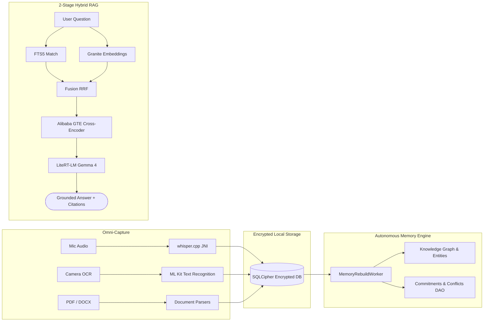

# NoteFlow AI 🧠⚡

> **100% Private, On-Device AI Note-Taking with a 2-Stage Hybrid RAG System & Autonomous Personal Memory Layer**

[](https://kotlinlang.org)
[](https://developer.android.com)
[](https://ai.google.dev/edge/litert)
[](https://onnxruntime.ai)
[](https://www.zetetic.net/sqlcipher/)
[](LICENSE)

---

NoteFlow AI is an offline-first **second brain** for Android. It replaces cloud-dependent note apps with high-velocity, sub-second local intelligence. By combining Google LiteRT-LM on-device inference, an Alibaba GTE neural cross-encoder, IBM Granite multilingual embeddings, and native C++ `whisper.cpp` speech recognition, NoteFlow AI turns your personal notes into an autonomous, interconnected knowledge network without cloud subscription fees or data leaks.

---

## ⚡ Quick Navigation

| Document | Description |
| :--- | :--- |
| 📖 **[HANDOFF.md](HANDOFF.md)** | **Complete Technical Architecture, Subsystems, ADRs, Incident Runbook & Ownership** |
| 🚀 **[SETUP.md](SETUP.md)** | **5-Minute Developer Quick Start, NDK Toolchain, Building & Troubleshooting** |
| 🛡️ **[CONTRIBUTING.md](CONTRIBUTING.md)** | **Contribution Guide, PR Checklist, Zero-Telemetry Rule & Security Policy** |
| ✅ **[RELEASE_CHECKLIST.md](docs/RELEASE_CHECKLIST.md)** | **Pre-Flight Release Gates, Smoke Test Protocols & QA Checklist** |

---

## 🌟 Key Superpowers

### 1. 🎙️ Omni-Capture Speed Dial
- **Local Speech-to-Text**: Native `whisper.cpp` JNI transcription compiles via NDK CMake — record and transcribe lectures, voice memos, and meetings with zero cloud exposure.
- **Multi-Source Ingestion**: Capture notes via camera OCR (ML Kit Text Recognition v2), import PDFs (PdfBox-Android), DOCX files (Apache POI), and YouTube transcripts.

### 2. 🧬 Autonomous Knowledge Graph & Personal Memory
- **Autonomous Memory Worker**: Background `WorkManager` pipeline parses updated notes to construct dynamic knowledge graph connections.
- **Commitments & Conflicts**: Surfaces actionable commitments with due dates and alerts you to conflicting statements made across different notes.
- **Daily & Weekly Digest**: Proactive memory reviews present relevant historical notes and resurface forgotten ideas.

### 3. 🎯 2-Stage Precision Hybrid RAG
- **Stage 1 (Hybrid Candidate Retrieval)**: Combines SQLite FTS5 full-text keyword matching with IBM Granite 311M Multilingual ONNX vector similarity via Reciprocal Rank Fusion (RRF).
- **Stage 2 (Neural Cross-Encoder Reranking)**: Scores top candidate excerpts through an INT8 quantized Alibaba GTE cross-encoder ONNX model.
- **Strict Citation Isolation**: Injects verified footnote citations (`[1]`, `[2]`) in note-grounded chat and refuses hallucinated claims when notes lack evidence.

### 4. ⚡ Google LiteRT-LM Local Inference
- **Gemma 4 E2B & E4B**: Run state-of-the-art Google Gemma models directly on device.
- **Hardware Acceleration**: Automatic OpenCL GPU acceleration with instant CPU (XNNPACK) fallback.
- **Streaming Response**: Real-time token streaming via a custom coroutine bridge.

---

## 🏗️ High-Level System Architecture



---

## ⏱️ Quick Start (< 10 Minutes)

### Prerequisites
- **Android Studio**: Hedgehog (2023.1.1) or newer
- **JDK**: 17
- **NDK**: `27.0.12077973`
- **CMake**: `3.22.1`

### Running the Project

```bash
# 1. Clone the repository
git clone https://github.com/Archeon84/noteflowai.git
cd noteflowai

# 2. Build Debug APK
./gradlew assembleDebug

# 3. Run all unit tests
./gradlew testDebugUnitTest

# 4. Install to connected device (API 30+)
./gradlew installDebug
```

For full setup instructions, common build errors, and keystore signing, read **[SETUP.md](SETUP.md)**.

---

## 📊 Performance Benchmarks (Tested on Pixel 6a)

| Operation | Metric | Notes |
| :--- | :--- | :--- |
| **Note Indexing (1,000 words)** | ~45–60 ms | Segmenting, FTS5 insert & Granite vector encoding |
| **Hybrid RAG Retrieval** | ~110–140 ms | Stage 1 candidate retrieval across 500+ notes |
| **GTE Cross-Encoder Rerank** | ~25–35 ms | Stage 2 ONNX cross-attention scoring |
| **Time-to-First-Token (TTFT)** | ~750–900 ms | Gemma 4 E2B on OpenCL GPU |
| **Generation Speed** | ~18–22 tok/sec | OpenCL GPU streaming |
| **Memory Rebuild Pipeline** | ~85–110 ms | Background WorkManager execution per 100 notes |

---

## 🔒 Privacy & Zero-Telemetry Guarantee

NoteFlow AI is built with an absolute **zero-telemetry commitment**:
- **No Third-Party Analytics**: No Firebase Crashlytics, no Google Analytics, no telemetry beacons.
- **Encrypted at Rest**: All note content and memory structures are encrypted with **SQLCipher** (AES-256).
- **Offline By Default**: Complete functionality is preserved in Airplane Mode.

For contribution guidelines and security protocols, refer to **[CONTRIBUTING.md](CONTRIBUTING.md)**.

---

## 📄 License

Distributed under the Apache License 2.0. See `LICENSE` for details.
